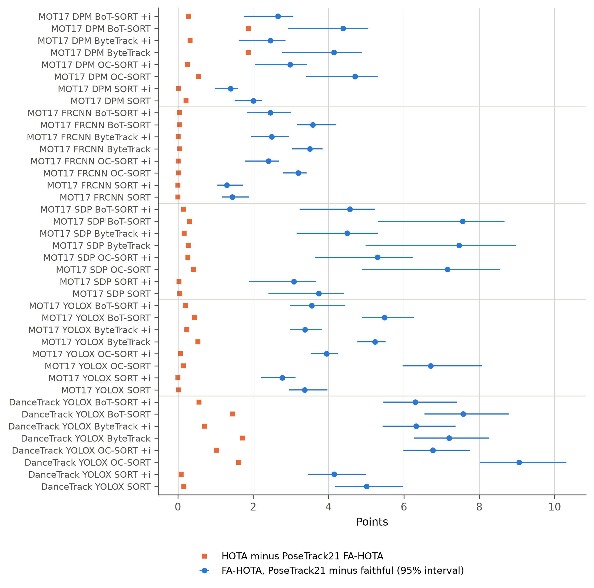

# A faithful and validated implementation of fragmentation-aware HOTA that counts detection-gap fragmentation

HOTA evaluates multi-object tracking by separating detection from association. Its fragmentation-aware extension,
FA-HOTA, and the fragmentation accuracy, FragA (Luiten et al., IJCV 2021, Sec. 8, Eqs. 32-34 of arXiv:2009.07736v2),
are defined to penalise tracks that are broken into pieces. The public implementation in the PoseTrack21 evaluation
kit starts a new fragment only when the predicted identity changes, so it ignores the missed detections and spurious
predictions that the definition counts. This repository provides `FAHOTA`, a drop-in metric for
[TrackEval](https://github.com/JonathonLuiten/TrackEval) that reuses HOTA's matches and breaks a fragment wherever
either identity of a matched pair appears between two of its matches. It reproduces the worked examples of the HOTA
paper, a literal set-based reference and a closed-form oracle to machine precision. The repository also contains
everything needed to reproduce the accompanying paper: the pre-registration and its deviations, the per-sequence
results, the cached detections and one command that regenerates every table and figure.



*FA-HOTA reported by the PoseTrack21 implementation minus the faithful FA-HOTA (blue, 95% sequence-bootstrap
interval) and HOTA minus the PoseTrack21 FA-HOTA (orange) for every confirmatory tracker output; "+i" marks linear
interpolation.*

## Key results

On the 40 pre-registered tracker outputs (4 trackers, raw and interpolated, 5 dataset/detector groups), the
PoseTrack21 implementation reports FA-HOTA 1.30 to 9.06 points higher than the definition, in every sequence of every
output (`results/tables/groups.md`; values in points):

| Dataset | Detector | Outputs | HOTA | FA-HOTA faithful | FA-HOTA PoseTrack21 | Gap (PoseTrack21 minus faithful) | Smallest 95% lower bound | Sequences with a positive gap |
|---|---|---|---|---|---|---|---|---|
| MOT17 train | DPM | 8 | 25.17–32.12 | 20.32–29.18 | 24.96–31.84 | 1.40–4.70 | 0.99 | 7/7 in every output |
| MOT17 train | FRCNN | 8 | 44.93–49.39 | 43.48–46.90 | 44.92–49.36 | 1.30–3.59 | 1.05 | 7/7 in every output |
| MOT17 train | SDP | 8 | 49.25–56.48 | 43.47–51.76 | 49.20–56.33 | 3.08–7.55 | 1.90 | 7/7 in every output |
| MOT17 train | YOLOX | 8 | 71.28–76.13 | 67.01–72.11 | 71.26–76.06 | 2.77–6.71 | 2.21 | 7/7 in every output |
| DanceTrack val | YOLOX | 8 | 43.98–52.89 | 36.10–45.09 | 43.30–51.86 | 4.15–9.06 | 3.45 | 25/25 in every output |

With a perfect tracker and 5.00% of MOT17 boxes removed, AssA and the PoseTrack21 FragA both stay at 95.00, while the
faithful FragA falls to 61.79 when the boxes are removed as one gap per track and to 11.51 when they are scattered
(`results/tables/oracle.md`). The planted-bug check catches the PoseTrack21 rule in 3596 of 5700 short-sequence
cases and 1863 of 1900 long-sequence cases (`results/tables/mutants.md`).

## Installation

Python 3.13 on Linux (tested with CPython 3.13.13); `git` is needed because TrackEval is installed from a commit pin.

```bash
python3.13 -m venv .venv
.venv/bin/pip install -r requirements.lock
```

`requirements.lock` pins every package, including TrackEval at commit `12c8791b303e0a0b50f753af204249e622d0281a`,
Ultralytics 8.4.138 and the CPU builds of PyTorch 2.14.0 and torchvision 0.29.0 (needed only by the Ultralytics
trackers). Every result runs on the CPU. For the optional GPU re-detection, install the matching CUDA build of
PyTorch 2.14.0 instead. On import, TrackEval prints `Error importing BURST due to missing underlying dependency`;
this concerns a dataset class that is not used here and can be ignored.

## Data

The datasets are not redistributed. Place them under `data/` (or point `FAHOTA_DATA` to another directory;
`FAHOTA_MOT17_IMG` moves only the MOT17 images). Only the tests in the first two rows of the table under
[Tests](#tests) and the quick start run without them.

| Input | Download | Licence | Expected path |
|---|---|---|---|
| MOT17 (5.9 GB) | https://motchallenge.net/data/MOT17.zip | MOTChallenge terms (CC BY-NC-SA 3.0) | `data/MOT17/train/<seq>-{DPM,FRCNN,SDP}/` with `det/`, `gt/`, `seqinfo.ini`, and `img1/` in the FRCNN copy |
| DanceTrack validation set (4.2 GB) | https://huggingface.co/datasets/noahcao/dancetrack/resolve/main/val.zip | non-commercial research only; annotations CC BY 4.0 | `data/dancetrack/val/dancetrack00NN/` |
| YOLOX detections released with MOTRv2 (21 MB) | Google Drive id `1cdhtztG4dbj7vzWSVSehLL6s0oPalEJo` (linked in the [MOTRv2 README](https://github.com/megvii-research/MOTRv2)) | MIT (MOTRv2 repository) | `data/published/det_db_motrv2.zip` and the extracted `data/published/det_db_motrv2.json` |
| TrackEval test data (150 MB; published MPNTrack, CIWT and QDTrack outputs) | https://omnomnom.vision.rwth-aachen.de/data/TrackEval/data.zip | terms of the underlying datasets and trackers | `data/published/trackeval_data.zip` and the extracted `data/published/trackeval_data/data/` |
| YOLO26 COCO weights (only for optional re-detection) | https://github.com/ultralytics/assets/releases/tag/v8.4.0 | AGPL-3.0 | `weights/yolo26s.pt`, `weights/yolo26x.pt` |

```bash
mkdir -p data/dancetrack data/published weights
curl -L -o data/MOT17.zip https://motchallenge.net/data/MOT17.zip && unzip -q data/MOT17.zip -d data/
curl -L -o data/dancetrack/val.zip https://huggingface.co/datasets/noahcao/dancetrack/resolve/main/val.zip \
  && unzip -q data/dancetrack/val.zip -d data/dancetrack/
.venv/bin/gdown 1cdhtztG4dbj7vzWSVSehLL6s0oPalEJo -O data/published/det_db_motrv2.zip \
  && unzip -q data/published/det_db_motrv2.zip -d data/published/
curl -L -o data/published/trackeval_data.zip https://omnomnom.vision.rwth-aachen.de/data/TrackEval/data.zip \
  && unzip -q data/published/trackeval_data.zip -d data/published/trackeval_data/
# optional, only for DETECT=1
for w in yolo26s yolo26x; do curl -L -o weights/$w.pt https://github.com/ultralytics/assets/releases/download/v8.4.0/$w.pt; done
sha256sum -c --ignore-missing checksums_inputs.sha256
```

Expected SHA-256 sums of the inputs (`checksums_inputs.sha256` also lists the vendored third-party code):

```
646f8bc3fe0a656803d95c294f7852321748cb29d13466a1af8862e2db384a1b  weights/yolo26s.pt
9fdd44a31c504547ffb81d2c6d9e6dac3493c8eaa8b0398d3f43bae6c7003e92  weights/yolo26x.pt
f1fc4f75bc4fbb40f7c0b8425b9f229613b23e63796906d1957b0978c09cd667  cache/dets/dancetrack/yolo26s.npz
0e8bd0f32109a76e8514dcf5542ceb728f316bca401930c6f9c5482a4e094318  cache/dets/dancetrack/yolo26x.npz
148a4bdf56f8cb32f9bde4b3d70717242cbb2e61900ef0101abc4652e268f2a5  data/published/trackeval_data.zip
84f17fe97ec2cb3cdf0810ad819c432502ac40a9e6fb63c9326cc8c0bb13f3c3  data/published/det_db_motrv2.zip
9f14068dc25e4c062a66c3bff807fa626eb1a0783fae7eebfeec389c05326b17  data/published/det_db_motrv2.json
90ba30973761ce0b81a9654c11086d87537392475ac8bc666d842e645641277c  data/dancetrack/val.zip
```

`sha256sum -c --ignore-missing checksums_inputs.sha256` checks whichever of them are present. MOTChallenge publishes no checksum for `MOT17.zip`, so it is not listed. The YOLO26
DanceTrack detections used in the paper ship in `cache/dets/dancetrack/` (raw 0-based detector boxes), so
re-detection is not needed; re-running it on another GPU is not guaranteed to be bit-identical.

## Quick start

A toy sequence with a two-frame detection gap and no identity change; needs no dataset:

```bash
.venv/bin/python scripts/quickstart.py
```

```
HOTA          0.7500
AssA          0.7500
FragA         0.3750
FragA_PT21    0.7500
FA-HOTA       0.6307
FA-HOTA_PT21  0.7500
```

The PoseTrack21 rule (`FragA_PT21`) sees one fragment and returns AssA; the faithful FragA counts the gap. To use the
metric in your own TrackEval evaluation, put `FAHOTA` in place of `HOTA` (it reports every HOTA field unchanged and
adds FragA, FAssA and FA-HOTA; TrackEval refuses two metrics that share field names):

```python
import sys; sys.path.insert(0, 'src')
from fahota import FAHOTA
import trackeval

dataset = trackeval.datasets.MotChallenge2DBox({...})  # your usual TrackEval dataset configuration
trackeval.Evaluator().evaluate([dataset], [FAHOTA(), trackeval.metrics.CLEAR(), trackeval.metrics.Identity()])
```

`src/fahota.py` depends only on TrackEval, NumPy and SciPy. `FAHOTACompare` adds the PoseTrack21 fields and the
ablations used in the paper.

## Reproducing the paper

With the data in place:

```bash
scripts/reproduce.sh
```

The script runs the tests, the four trackers on both datasets, the evaluation, the analytic oracle, the PoseTrack21
cross-checks, the re-scoring of published outputs, the dropout study, the statistics, the outputs added after
pre-registration (from the cached detections) and the tables and figures. It writes `results/` and `figures/`.
The final clean run for the paper took 2 h 43 min on one CPU core (peak memory about 4 GB); the tracker outputs in
`results/tracks*/` need about 650 MB of disk. The script sets `OMP_NUM_THREADS`, `OPENBLAS_NUM_THREADS` and
`MKL_NUM_THREADS` to 1, the setting under which the tracker outputs were byte-identical across runs.
`PYTHON=/path/to/python scripts/reproduce.sh` selects another interpreter. `DETECT=1 scripts/reproduce.sh` first
re-runs YOLO26 detection on a GPU.

Expected checksums: every result file whose content does not depend on wall time is listed in
`results/CHECKSUMS.sha256` and must match after a run:

```bash
sha256sum -c results/CHECKSUMS.sha256
```

The timing-dependent files (`results/pt21_crosscheck/*.json`, `results/pt21_multiclass.json`) are compared without
their timing fields by `src/c1_diff.py <copy>`, which compares a re-run made in a separate copy of the repository
with this one (`results/c1_diff.json` is that comparison for the paper: 1757 of 1760 files byte-identical, the other
3 equal without timings). `results/timing_runs/` holds the per-sequence timings of the four full runs made for the
paper, from which `src/timing_summary.py` builds the cost table. Figures are byte-identical on the same machine but
depend on the installed fonts.

**Pre-registration.** `preregistration/PREREG.md` (SHA-256 `6dc7c73feb131819226509f505cceca7bde285f4631534d6175ec6a864799b7c`) was hashed
before any tracker was run, and `preregistration/PREREG_ADDENDUM_H5.md` (SHA-256
`4c038323ac667c48054176630d8ea054507f5825c8d96db801a6bb87438a7a4b`) before any dropout run. Both files are unchanged
since hashing. `preregistration/DEVIATIONS.md` lists every departure from them.

```bash
sha256sum preregistration/PREREG.md preregistration/PREREG_ADDENDUM_H5.md
```

## Repository structure

```
.
├── src/
│   ├── fahota.py              FAHOTA and FAHOTACompare (the metric)
│   ├── datasets.py            dataset, detection and ground-truth handling
│   ├── detect.py              optional YOLO26 detection -> cache/dets/
│   ├── track.py               SORT, ByteTrack, BoT-SORT, OC-SORT with frozen stock configurations
│   ├── evaluate.py            TrackEval evaluation -> results/metrics*/
│   ├── oracle.py              closed-form oracle (H4)
│   ├── analyze.py             pre-registered statistics (H1-H3, E1-E2)
│   ├── dropout.py             detector dropout study (H5)
│   ├── pt21_crosscheck.py     PoseTrack21 hota.py against FAHOTACompare on real sequences
│   ├── pt21_multiclass.py     PoseTrack21 hota.py on TrackEval's multi-class path
│   ├── rescore_published.py   re-scoring of published tracker outputs
│   ├── pixel_convention.py    ground-truth and detection pixel conventions
│   ├── determinism.py         tracker determinism re-run
│   ├── example.py             qualitative example
│   ├── figures.py, tables.py, timing_summary.py
│   ├── c1_diff.py             compare a re-run in another copy with this repository
│   └── third_party/           vendored SORT, OC-SORT, ByteTrack interpolation, PoseTrack21 hota.py
├── tests/                     correctness tests and the planted-bug check
├── scripts/
│   ├── reproduce.sh           one-command reproduction
│   └── quickstart.py          minimal usage example
├── preregistration/           PREREG.md, PREREG_ADDENDUM_H5.md (hashed), DEVIATIONS.md (deviations)
├── results/                   per-sequence metrics, analyses, tables, cross-checks, timing runs, CHECKSUMS.sha256
├── figures/                   paper figures (PDF, PNG)
├── cache/dets/dancetrack/     cached YOLO26 DanceTrack detections
├── assets/                    README figure
├── checksums_inputs.sha256    SHA-256 of inputs, weights and vendored code
└── requirements.lock
```

## Tests

| Check | Command | Expected output | Data |
|---|---|---|---|
| HOTA Fig. 5 worked examples, detection-gap and spurious-association cases, literal set-based reference, properties, PoseTrack21 cross-check | `.venv/bin/python tests/test_fahota.py` | 7 lines `PASS test_...` | none |
| planted-bug (mutation) check of the vectorised code | `.venv/bin/python tests/mutation_check.py` | last line `matches results/mutation_check.json` | none |
| closed-form oracle on a dataset's ground truth | `cd src && ../.venv/bin/python oracle.py mot17` | last line `H4 HOLDS mot17` | MOT17 |
| interpolation equals ByteTrack's own `dti()` | `.venv/bin/python tests/test_interpolation.py` | 2 lines `PASS ...` | MOT17, DanceTrack |

## Citation

The paper is under review; citation details will be added on publication.

```bibtex
@misc{fahota2026,
  title = {A faithful and validated implementation of fragmentation-aware HOTA that counts detection-gap fragmentation},
  year  = {2026}
}
```

## Licence

GNU General Public License v3.0 (`LICENSE`). SORT is vendored under GPL-3.0 and ByteTrack and BoT-SORT run from
Ultralytics under AGPL-3.0; the other vendored files are MIT. See `THIRD_PARTY_NOTICES.md`. The datasets keep their
own terms of use.

## Acknowledgements

The metric follows J. Luiten, A. Ošep, P. Dendorfer, P. Torr, A. Geiger, L. Leal-Taixé and B. Leibe, "HOTA: a higher
order metric for evaluating multi-object tracking", Int. J. Comput. Vis. 129 (2021) 548-578,
https://doi.org/10.1007/s11263-020-01375-2; please cite it when you use FA-HOTA. We use
[TrackEval](https://github.com/JonathonLuiten/TrackEval), [SORT](https://github.com/abewley/sort),
[OC-SORT](https://github.com/noahcao/OC_SORT), [ByteTrack](https://github.com/ifzhang/ByteTrack),
[Ultralytics](https://github.com/ultralytics/ultralytics) (ByteTrack, BoT-SORT and YOLO26) and the PoseTrack21
evaluation kit ([PoseTrack21](https://github.com/anDoer/PoseTrack21)), and the MOT17
([MOTChallenge](https://motchallenge.net/)) and [DanceTrack](https://github.com/DanceTrack/DanceTrack) datasets, the
YOLOX detections released with [MOTRv2](https://github.com/megvii-research/MOTRv2) and the test data of TrackEval.
